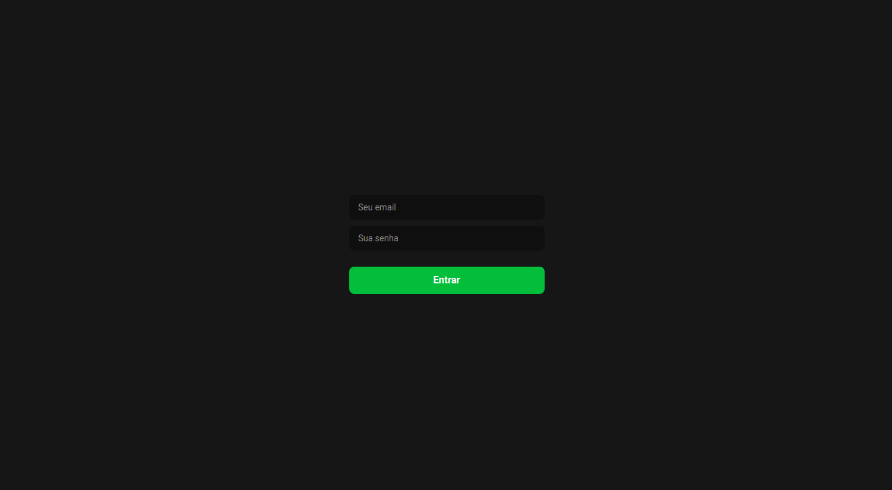
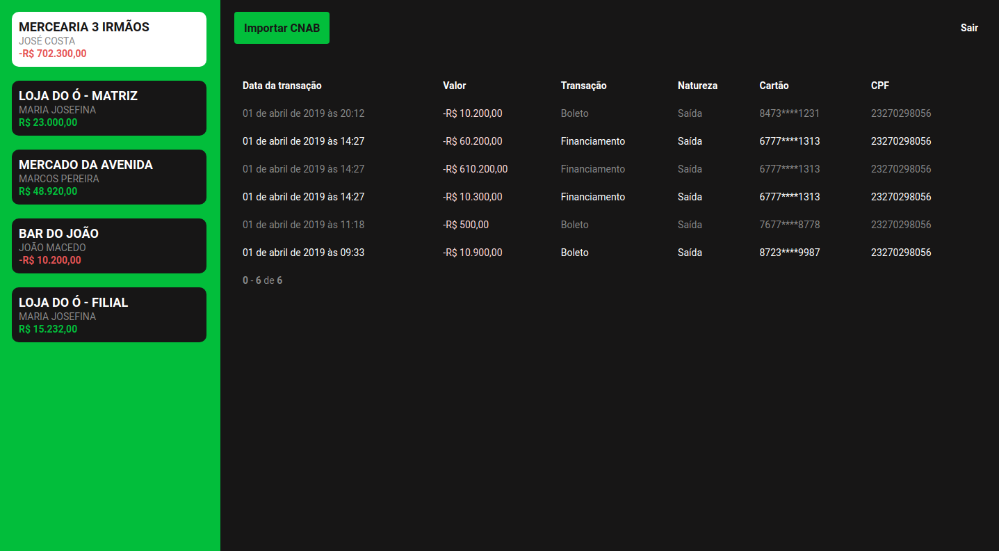

<h1 align="center">Desafio programação</h1>

<p align="center">Projeto desenvolvido com a finalidade de completar o desafio proposto pela empresa ByCoders, à vista disso foi realizado o desenvolvimento de uma API e uma aplicação web.</p>

<div align="center">


</div>

---
</br>

## 🚀 Começando

### Pré Requisitos

- Para executar o projeto em ambiente local é necessário possuir o [Docker](https://docs.docker.com/get-docker/) e [Docker Compose](https://docs.docker.com/compose/install/) instalados.

### Clone

- Clone este repositório em seu computador usando:

```
https://github.com/wagnergos/desafio-dev
```

### Executando

- Acesse a pasta da API e copie o arquivo de .env.example (variáveis de ambientes) e renomeie-o para .env

- Construa os serviços do docker utilizando o seguinte comando na pasta raiz do projeto:

```
docker-compose build
```

- Com os containers do docker montados, inicie-os, na pasta raiz do projeto use:

```
docker-compose up -d
```

- Feito isso você terá acesso aos seguintes links:
    - Aplicação web em [http://localhost]( http://localhost)
    - API em [http://localhost:3333]( http://localhost:3333)
    - Documentação da API em [ http://localhost:3333/api-docs](http://localhost:3333/api-docs)

- Caso queira parar o contêiner do docker, na pasta raiz use:

```
docker-compose stop
```

- Ou se quiser remover tudo que o build do docker criou, na pasta raiz use:

```
docker-compose down
```

## Algumas observações sobre a aplicação

- Não foi desenvolvido a rota para criação de usuários, portanto para realizar a autenticação de usuário utilizar os seguintes dados:
    - email: **desafiodev@email.com**
    - password: **desafiodev**

## 📋 Funcionalidades

- [x] Interface web para importação de arquivo .txt
- [x] Parsear e normalizar os dados de um arquivo CNAB.txt e salvar em uma base de dados
- [x] Listar as transações advindas do CNAB filtrado por lojas
- [x] Listar as lojas com totalizador do saldo em conta
- [x] Persistência de alguns dados no localStorage 
- [x] Autenticação com JWT
- [x] Logout automático quando o JWT expira
- [x] Notificações por Toasts

### Tecnologias

- Interface
    - [ReactJS] - Um framework para desenvolvimento de interfaces web com React
    - [Styled Components](https://styled-components.com/) - Use os melhores bits de ES6 e CSS para estilização
- Navigation
    - [React Router Dom](https://reactrouter.com/web/guides/quick-start) - Roteamento e navegação para aplicativos ReactJS
- Comunicação HTTP
    - [Axios](https://github.com/axios/axios) - Cliente HTTP baseado em promise para os navegadores web e Node.js
- Verificação de tipo
    - [prop-types](https://github.com/facebook/prop-types) - Verificação de tipo de tempo de execução para propriedades React ou objetos similares.
- Linting
    - [ESLint](https://github.com/eslint/eslint) - Encontrar e corrigir problemas em seu código JavaScript
    - [Prettier](https://prettier.io/) - Formator de código opinativo
- a
    - [Express](https://expressjs.com/pt-br/) - Um framework rápido, fléxível para construção de servidores em Node.js
- Banco de dados
    - [PostgreSQL](https://www.postgresql.org/) - Banco de dados relacional open source
    - [Sequelize](https://sequelize.org/) - ORM baseado em promise para Postgres
- Documentação
    - [Swagger](https://swagger.io/) - Ferramenta para simplificar a documentação de APIs
- Testes
    - [Jest](https://jestjs.io/pt-BR/) - Framework de testes em JavaScript
- Plataforma de conteinerização
    - [Docker](https://www.docker.com/) - Virtualização de pacotes de software isoladas chamadas de contêineres
    - [Docker Compose](https://docs.docker.com/compose/) - Ferramenta para definir e executar aplicativos Docker de vários contêineres
- Extra
    - [eslint-config-airbnb](https://github.com/airbnb/javascript) - Uma abordagem para JavaScript utilizando a style guide do Airbnb

### Fluxo da interface web

- Tela inical para realizar a autenticação de usuário informando email e senha. **(email e senha de usuário cadastrado para autenticação: email: desafiodev@email.com, password: desafiodev)**

- E uma única tela para exibição das lojas e tabela contendo as transições.

    - As lojas são listadas em uma barra lateral em formato de botões que ao evento de selecionar (clicar) realizam a busca na API para as informações das transações da loja selecionada.

    - As transações exibidas na tabela é de uma loja por vez.

### Documentação da API

- Como supracitado ao inicializar os contêineres do Docker a API ficará disponível no link:
    - [ http://localhost:3333/api-docs](http://localhost:3333/api-docs)

- A API possui 4 endpoints sendo eles:
    - **/sessions** - para realizar a autencação do usuário, o qual envia um email e password e a API retorna um json web token para autenticações futuras.

    - **/cnab** - realiza a importação do arquivo CNAB.txt e executa os services responsáveis por parsear e normalizar a informação, após os dados normalizados é acionado o service para realizar o salvamento dos dados na base de dados.
    
    - **/transactions/{storeId}?page=1** lista todas as transações filtrando por loja e limitando a quantidade de registros para 10 a cada página. A API envia como header X-Total-Count com o valor total dos registros para a loja.

    - **/stores** lista todas as lojas já com o valor total em conta.

### Testes

- Na pagina da API use o comando:

```
yarn test
```

- Só foi desenvolvido testes de integração e unitários na API
